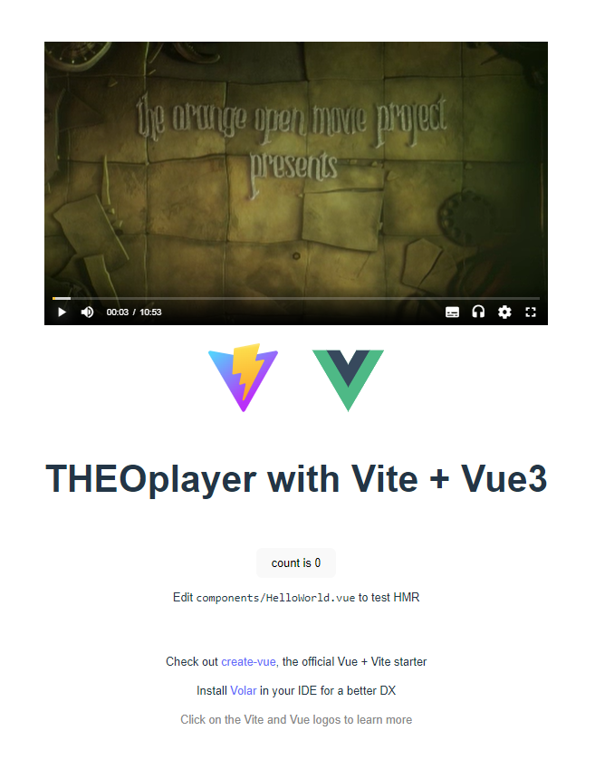

# A player example app with THEOplayer Web SDK and Vue3/Vite

This is a repository for a player example app with THEOplayer Web SDK and Vue3/Vite.

THEOplayer is the universal video player solution created by THEO Technologies. The THEOplayer offers player SDKs for multiple platforms (such as HTML5 (Web), Apple iOS, Apple tvOS, Google Android, Google Android TV, Samsumg Tizen, LG webOS, Amazon FireTV, ROKU) which support for HLS, MPEG-DASH, advertisements, DRM and much more.

Vue is a progressive JavaScript framework for building user interfaces. It builds on top of standard HTML, CSS and JavaScript, and provides a declarative and component-based programming model.

Vue ecosystem covers most of the common features needed in frontend development. But the web is extremely diverse - the things we build on the web may vary drastically in form and scale. Vue is designed to be flexible and incrementally adoptable. Depending on your use case, Vue can be used in different ways:

* Enhancing static HTML without a build step
* Embedding as Web Components on any page
* Single-Page Application (SPA)
* Fullstack / Server-Side Rendering (SSR)
* Jamstack / Static Site Generation (SSG)
* Targeting desktop, mobile, WebGL, and even the terminal

This player example is simply implemented with Vue3/Vite and Composition API on a starter template which is provided by Vue CLI tools.

## Step-by-Step to integrate THEOplayer Web SDK

### Prerequisites

The following dev tools are used for this guide.

| Tools | Version  |
| ----- | -------: |
| npm   | 8.19.2   |
| yarn  | 1.22.5   |
| node  | v16.18.0 |

### 1. Create a Vue3 app template

Run the following command to create a Vue3 application template:

```shell
yarn create vite theoplayer-web-vue-example --template vue-ts
```

The command output will be like as follows:

```text
yarn create v1.22.5
[1/4] Resolving packages...
[2/4] Fetching packages...
[3/4] Linking dependencies...
[4/4] Building fresh packages...
success Installed "create-vite@3.1.0" with binaries:
      - create-vite
      - cva

Scaffolding project in C:\srcs\THEOplayer\theoplayer-web-vue-example...

Done. Now run:

  cd theoplayer-web-vue-example
  yarn
  yarn dev

Done in 14.52s.
```

### 2. Install required components

Run the following command to install Vue framework package dependencies.

```shell
yarn install
```

> You can ignore information messages about `esbuild` module in yarn command output.

### 3. Add THEOplayer

#### 3.1 Add module declaration (THEOplayer.d.ts)

Run the following command to install theoplayer NPM package, which includes type definition module for THEOplayer Web SDK.

```shell
yarn add theoplayer
```

#### 3.2 Add `Player.vue` for THEOplayer Web SDK

Add the following code to `src/components` folder as `Player.vue`.
This code is based on Vue3 Composition API and works with a given `source` array variable from parent component.

```typescript
<script setup lang="ts">
import { ref, onMounted } from "vue";

const theoplayer = ref<HTMLElement | null>(null);
const props = defineProps<{ source: Array<any> }>();

function playerInit() {
  if (theoplayer.value != null) {
    const player = new window.THEOplayer.Player(theoplayer.value, {
      fluid: true,
      libraryLocation: "//cdn.theoplayer.com/dash/theoplayer/",
    });
    player.source = {
      sources: props.source,
    };
  }
}

onMounted(() => {
  playerInit();
});
</script>

<template>
  <div
    class="theoplayer-container video-js theoplayer-skin vjs-16-9 theoplayer"
    ref="theoplayer"
  ></div>
</template>

<style scoped>
.theoplayer-container {
  margin: 0 auto;
  padding-top: 56.24%;
  width: 100%;
}
</style>
```

#### 3.3 Add `Player.vue` component to `App.vue`

Add the following script code piece to `<script setup>` section in `src/App.vue` after a line for importing `HelloWorld` component.

```typescript
import Player from "./components/Player.vue";
import { ref } from "vue";
const source = ref([
  {
    type: "application/x-mpegurl",
    src: "//cdn.theoplayer.com/video/elephants-dream/playlist.m3u8",
  },
]);
```

Add the following line to `<template>` section in `src/App.vue` just after the first `<div>` block.

```html
    <Player :source="source" v-if="source" />
```

#### 3.4 Add THEOplayer type declaration in `main.ts`

Add the following script code piece to `src/main.ts` before a line of `createApp` function call.

```typescript
// Import types for THEOplayer
import theoplayer from "theoplayer";

declare global {
    interface Window {
        THEOplayer: typeof theoplayer;
    }
}
```

#### 3.5 Add THEOplayer JavaScript and CSS module in `index.html`

Add the following lines to `<head>` section in `index.html` (just before `</head>` line) to import THEOplayer CSS.

```html
    <link
      rel="stylesheet"
      type="text/css"
      href="//cdn.theoplayer.com/dash/theoplayer/ui.css"
    />
```

Add the following lines to `<body>` section in `index.html` (just before `</body>` line) to load THEOplayer JavaScript codes.

```html
    <script
      type="text/javascript"
      src="//cdn.theoplayer.com/dash/theoplayer/THEOplayer.js"
    ></script>
```

### 4. Run this sample application code and open with your browser

Run the following command to compile the codes and run a local server to host the sample application.

```shell
yarn dev
```

The command output will be like as follows:

```text
yarn run v1.22.5
$ vite

  VITE v3.2.0  ready in 750 ms

  ➜  Local:   http://127.0.0.1:5174/
  ➜  Network: use --host to expose

```

You can browse the application with `localhost` hostname and given port to see how it works.

This application uses a public THEOplayer player code with builtin license, which allows you to enable playback functionality in THEOplayer without your explicit license, but it is allowed only in `localhost` as its white-listed hostname. This means that you will see an error message ("_The given license is invalid!_") when you will run this application except on `localhost`.

> Please note that you cannot run the public THEOplayer player code even in `127.0.0.1`, since it's not match with `localhost` as a string.

The screenshot is as belows:



## Using your local THEOplayer Web SDK

If you want to use your own THEOplayer Web SDK, you will need to put your (customized) Web SDK under `public` folder of Vue3 source tree.

Then, you will need to modify the following files to point the location of THEOplayer JS/CSS and library folder appropriately.

* index.html
* src/components/Player.vue

For example, if you will put the SDK files into `public/js/theoplayer` folder, index.html and `src/components/Player.vue` will be as below:

`index.html`:

```html
  <head>
    :
    <link
      rel="stylesheet"
      type="text/css"
      href="/js/theoplayer/ui.css"
    />
  </head>
```

`index.html`:

```html
  <body>
    :
    <script
      type="text/javascript"
      src="/js/theoplayer/THEOplayer.js"
    ></script>
  </body>
```

`src/components/Player.vue`:

```typescript
    const player = new window.THEOplayer.Player(theoplayer.value, {
      fluid: true,
      libraryLocation: "/js/theoplayer/",
    });
```

## Closing

This repository gives you a sample THEOplayer component for Vue3 by using Vue3 Composition API.
